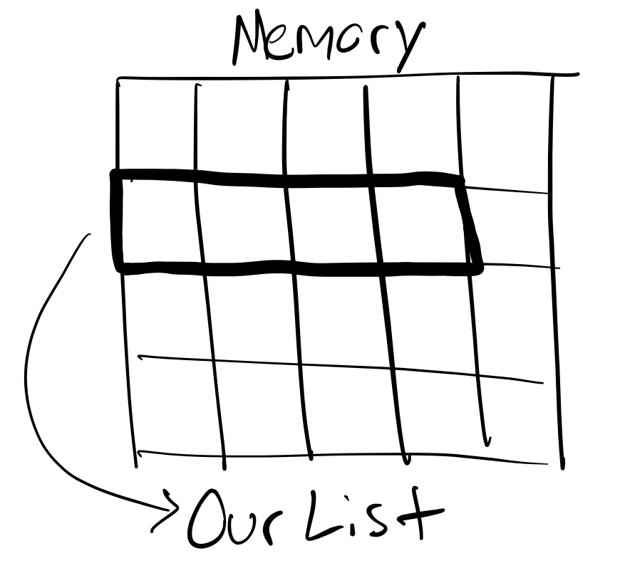
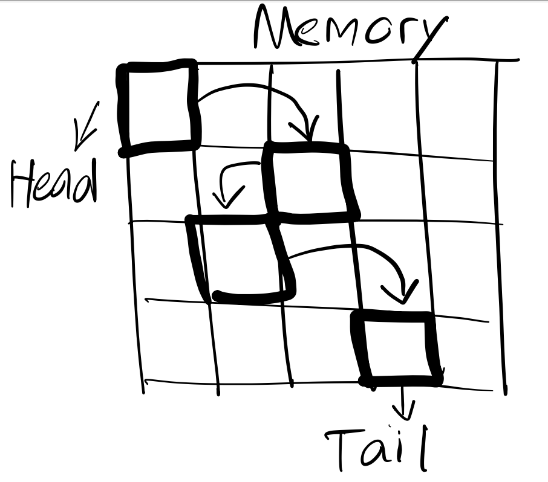
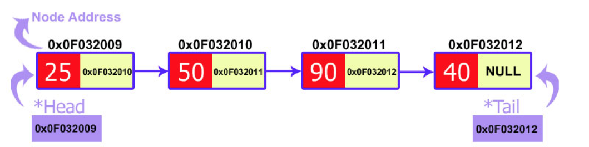

# Linked Lists

We know that a normal list can be visualized as a continous block of cells in memory and that we can look up a value with
an index in constant time because we know the starting place of the list in memory we just add the index and get the value: 

A Linked List on the other hand instead of continous memory its data is stored across memory in nodes. A Linked List is a
node based data structure. You can think of a node in the case of a Linked List as a class with 2 attributes. These two attributes 
are the data the node holds, and a pointer to the next node in the list. Here is a visualization the memory:

Here is a visualization of the nodes: 

In this level you'll learn about why a Linked List is advantagous at times, a implementation from scratch of a LL, an example 
of where Linked Lists are used in real life, problems and solutions to Linked List related Leetcode problems and different
kinds of linked lists. 

Go back to minecraft and continue! Good luck warrior. 
